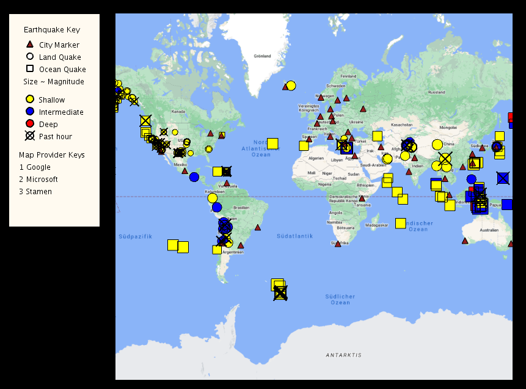

# UCSD UnfoldingMaps

### Overview
This project was done in lieu of UC San Diego's course [Object Oriented Programming in Java](https://www.coursera.org/learn/object-oriented-java/home/welcome) on Coursera. 

It is an interactive map that shows data of recent earthquakes across the world. Data is taken from USGS feeds of earthquakes of magnitudes 2.5 and above in the past week.

-- Christine Garcia

### Course's given README:
unfolding_app_template and UC San Diego/Coursera MOOC starter code
==================================================================

This is a skeleton to use Unfolding in Eclipse as well as some starter
code for the Object Oriented Programming in Java course offered by 
UC San Diego through Coursera.

A very basic Unfolding demo you'll find in the source folder in the default package. 
For more examples visit http://unfoldingmaps.org, or download the template with
examples.

The module folders contain the starter code for the programming assignments
associated with the MOOC.

Get excited and make things!

INSTALLATION

Import this folder in Eclipse ('File' -> 'Import' -> 'Existing Projects into
Workspace', Select this folder, 'Finish')

MANUAL INSTALLATION

If the import does not work follow the steps below.

- Create new Java project
- Copy+Paste all files into project
- Add all lib/*.jars to build path
- Set native library location for jogl.jar. Choose appropriate folder for your OS.
- Add data/ as src

TROUBLE SHOOTING

Switch Java Compiler to 1.6 if you get VM problems. (Processing should work with Java 1.6, and 1.7)

